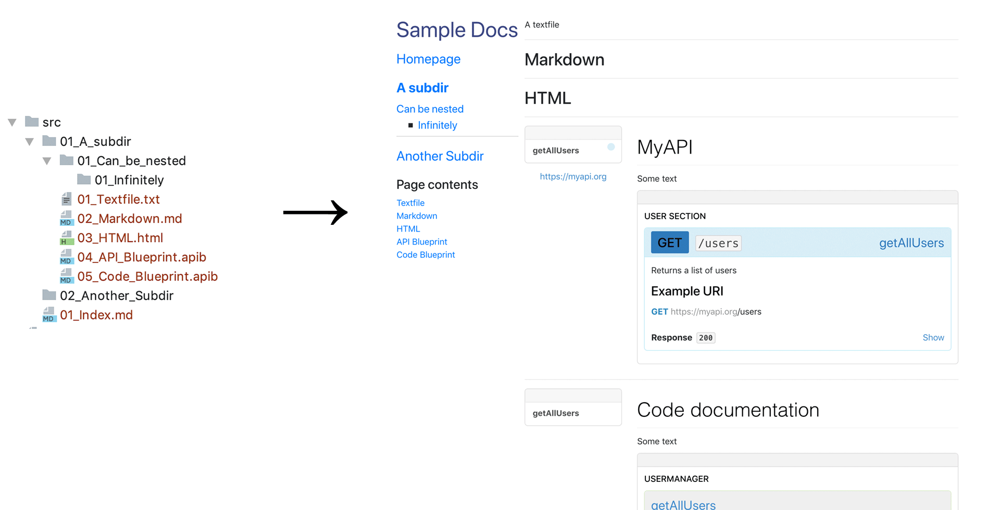

# Docs-Assembler
A command line tool that helps to create a HTML documentation out of various source files like Markdown and API Blueprint.

## Notes
This project was created in 2016. Therefore the dependencies are horribly out of date. If anyone wants to update the dependencies, I'm happy for PRs!

## Prerequisites
- [NodeJS](https://nodejs.org), tested with v6.2.1

## Installation
- Run `npm install` in the root directory
- Although not required, it's recommended to create a softlink to the `index.js` file in a directory that's included in the path. That way the command can be used from any working directory

## Usage
The Docs-Assembler Script transforms a collection of documentation input files into a structured HTML tree. It can be used both for manuals targeted for end users or for developer documentation.

### config.json
The script reads its configuration from a simple key-value json file. An example config file looks like this:
```
{
  "docsRoot": "src",
  "outputDir": "dist",
  "stylesheets": ["css/style.css", "css/docs.css"],
  "pageTitle": "My Super Documentation",
  "menuTitle": "Documentation",
  "iniSeparator": "----",
  "contentSeparator": "<hr>",
}
```
The available commands are:

- `docsRoot`: The directory that contains your documentation source files (see next chapter)
- `outputDir`: The directory where the output html (along with all images and stylesheets) are copied to
- `stylesheets`: An array of css-files that are included in the output html. Feel free to use your own unique documentation style! For a quicker start, a sample css is included in the `styles` folder of this repository along with the less sources.
- `pageTitle`: The HTML page title of the generated documentation
- `menuTitle`: The heading above the sidebar menu
- `iniSeparator`: Every source file can contain an (optional) initialisation section. The separator (defaulting to `----`) separates the initialisation section from the actual content (see next chapter).
- `contentSeparator`: Docs-Assembler can combine multiple documentation source files into a single HTML page. The Content Separator (defaulting to `<hr>`) is inserted between source files.

### Directory Structure
Within the source directory, you can place source files in a nested directory structure. All source files in the same directory level are compiled together on a single page. That way you can for example combine markdown content and an api documentation. Source files on the root level form the startpage. Each subfolder represents the first navigation hierarchy, subfolders the second and so on. For each page, a page index is automatically created listing all source files of the page (just below the menu).



The menu item labels are based off the directory names. Underscores are replaced by spaces and leading numbers folowed by an underscore are ommitted from the label but are used for ordering the directories. The same applies for the filenames of source files.

### Source files
The following types of source files are supported at the moment:
- __Plain text files__ (`.txt`)
- __Markdown files__ (`.md`): rendered via the [CommonMark JS Parser](https://www.npmjs.com/package/commonmark). You can use images, videos and alike by placing them in the same directory as the source file.
- __HTML files__ (`html`): HTML is inserted as is. You can use images, videos and alike by placing them in the same directory as the source file. If you need additional JS or HTML insert them right in the HTML as `<script>` or `<style>` tags. You can include stylesheets in the config.json file or modify `templates/index.tmpl` to include scripts on every page.
- __API Blueprint Files__ (`.apib`): [API Blueprint](https://apiblueprint.org/) is a description language for Web APIs. It is rendered via [Aglio](https://github.com/danielgtaylor/aglio). There are two styles included in Docs-Assembler, a default Style for API documentation and a "Code" Style where the spec is misused to document classes and its methods (see next subsection)

### Initialisation section
At the start of each source file you can add an optional intialisation section. It is separated from the content by the `iniSeparator` configuration option which defaults to `----`. The ini section contains a key-value pair per line in the format `Key = Value`.

The following options are available:
- `title`: If desired, the title of the source file in the file contents which defaults to the filename can be overridden
- `menuTitle`: If desired, the page title of the source directory of the current file which defaults to the directory name can be overridden. Use this option only in one source file per directory.
- `parser`: Per default, the parser is determined automatically by the file extension. You can manually override this. The allowed values are `markdown`, `html`, `text` and `api-blueprint`
- `noRest` (applies only for `.apib` files): If set to `1`, an alternative formatting style is used which "misuses" the API Blueprint for Class documentation. Note that you still need to add the modifiers like `[GET]` although they are not displayed in this style, since otherwise it won't render correctly


### CLI Usage
The CLI usage is `./index.js config.json`. The argument defaults to `config.json` if no command line argument is given. Note that currently, your working directory needs to be set to the directory where the configuration json file is located.


## Missing Features
The following features are desirable or where at some time planned but not yet implemented. I'm happy for pull requests implementing these features!

[ ] Support for YAML API specifications  
[ ] Responsive design for the sample  
[ ] The script currently only runs successfully when the directory where the config.json is located is also the working directory. This is an annoying restriction that should be removed